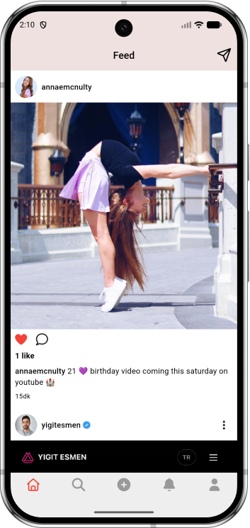
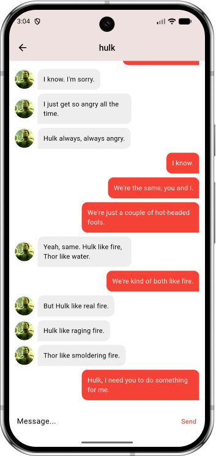
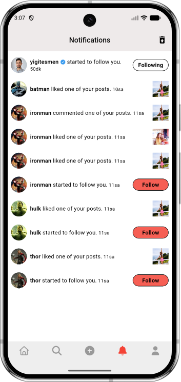
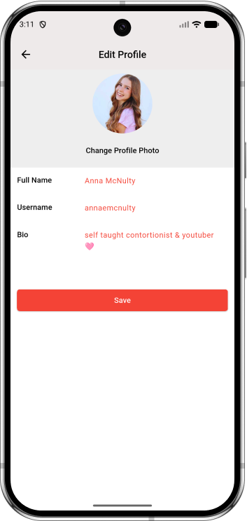

<p align="center">
  
</p>

<h1 align="center">Piqo</h1>

<p align="center">
  Real-time feed for captioned posts, likes, and comments, using managed backend<br/>
  services to meet the client's timeline without a custom server.
</p>

<p align="center">
  
  
  
  
  
  
  
</p>

<p align="center">
  ⭐ If you like this project, consider giving it a star.
</p>

<br/>

## Project Overview

Piqo is a photo-sharing social app built with Flutter. The codebase follows an MVVM architecture — views stay focused on presentation, `ChangeNotifier`-based ViewModels (Provider) own state and business logic, and a dedicated data layer feeds both. Piqo talks directly to Firebase: Cloud Firestore for data, Firebase Auth for sessions, Firebase Storage for media, and Cloud Functions for server-side fan-out.

## Features

- Registration, login, password reset, and policy acceptance backed by Firebase Auth, with persistent sessions
- Upload posts with an image and caption (Firebase Storage)
- Home feed of posts from followed users, fanned out server-side by Cloud Functions on share/delete and follow/unfollow
- Like and comment on posts
- Follow / unfollow users, with followers and following lists
- User profiles (own and others'), with profile editing
- Direct messages between users, written client-side to Firestore
- Notifications for likes, comments, and new followers
- Search for users
- English / Turkish localization

## 📱 Screenshots

<p align="center">
  
  
  
  
</p>
<p align="center">
  
  
</p>

## Architecture

Views watch a ViewModel and render its state. ViewModels expose actions (e.g. `toggleLike`, `sendMessage`) and own everything the view needs — controllers, derived state, and calls into the data layer. The data layer (`api/`) is the only part that talks to Firebase directly for cross-cutting concerns like the current user and storage uploads; feature ViewModels query Firestore collections directly for their own data.

## Project Structure

Piqo is organized feature-first: each screen owns its `views` and `view_models` in one folder, while cross-cutting concerns (data, models, navigation, providers, theme) live at the top level.

```
lib/
├── api/                    # Firebase Auth/Firestore helpers (user service, storage)
├── core/                   # Feature modules (MVVM): views, view_models
│   ├── authentication/     # Login, registration, password reset, policy
│   ├── main/               # Root shell and bottom tab navigation
│   ├── feed/                # Home feed
│   ├── comments/           # Post comments
│   ├── messages/           # Conversations and chat
│   ├── notifications/      # Likes, comments, follows
│   ├── profile/            # Profile view, edit profile, settings
│   ├── search/             # User search
│   ├── upload_post/        # Post creation
│   ├── users/               # Followers / following lists
│   └── components/         # Shared widgets used across features
├── models/                 # Domain models (Post, Comment, Message, Notification, User)
├── navigation/             # Route generator
├── providers/              # App-wide ChangeNotifiers (Auth, Locale)
├── theme/                  # App theme and brand colors
└── main.dart
```

## Tech Stack

**Mobile**
- Flutter / Dart
- Provider (state management)
- Firebase Auth (authentication)
- Cloud Firestore (data)
- Firebase Storage (media)
- Cloud Functions (feed and follower fan-out)
- Shared Preferences (local settings persistence)
- Image Picker (post and profile photo uploads)

## Why MVVM?

MVVM keeps UI code declarative and free of business logic. Views only describe what to render for a given state; ViewModels own that state, expose intent-based methods, and are trivial to reason about independently of any widget tree. Paired with Provider, this gives Piqo predictable state updates and a clear boundary for where Firebase calls are allowed to live.

## Getting Started

**Prerequisites:** Flutter SDK with Dart (see `pubspec.yaml`), a Firebase project with Auth, Firestore, and Storage enabled, and a configured iOS Simulator / Android emulator or physical device.

```bash
# Clone repository
git clone https://github.com/yigitesmen/piqo.git
cd piqo

# Install dependencies
flutter pub get

# Run application
flutter run
```

## Backend

Piqo doesn't run a separate API server — it talks to Firebase directly from the client. Cloud Functions in [`functions/`](functions/index.js) handle server-side work that shouldn't run on-device: fanning out new and deleted posts, and follow/unfollow changes, into each follower's feed. Firestore access is governed by [`firestore.rules`](firestore.rules).

---

<p align="center">
  ⭐ If you enjoy this project, consider giving it a star.
</p>

## License

Licensed under the [MIT License](LICENSE).

## Author

**Yigit Esmen**

- GitHub: [@yigitesmen](https://github.com/yigitesmen)
- Portfolio: [yigitesmen.com](https://yigitesmen.com)
